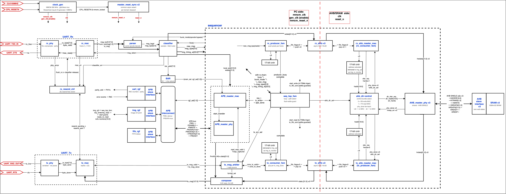

# Full duplex RGB image exchange between FPGA and PC over UART

A back pressure controlled data pipe on a Xilinx Artix 7 FPGA (Nexys A7
100T). I wrote all the RTL in SystemVerilog: a custom UART PHY and MAC,
an AHB-Lite image path into per channel SRAM, an APB bus to the register
file, and PLL based clocking with CDC handling between the two domains.

The numbers. A 256x256 RGB image transfers in 0.360 s instead of the
7.93 s a 1 Mbaud link needs, a 22x gain. A 280 MHz PLL clock pushes the
UART to 8 Mbaud at 16x oversampling for 8x the line rate, and a burst
frame carrying 4 pixels per message instead of 1 lifts protocol
efficiency from 19.8% to 54.5%, so goodput reaches 545 kB/s. RTS/CTS
flow control and back pressure handshakes on every stage keep the
stream lossless under stall. Timing closed at 280 MHz with positive
setup and hold slack, using multicycle constraints on the enable paced
logic and false paths across the asynchronous FIFO crossings.

## Architecture

The RX PHY samples the line at 16x the baud rate and delivers bytes with
parity and framing status to the RX MAC, which assembles the 6 and 16
byte messages and triggers a resend request on any line error. A parser
splits each message into opcode and fields. The classifier routes it,
register operations to the APB master and the register file, image
bursts into the data pipe, with a BAR decoding the address MSBs into the
target select. During a burst the sequencer streams the payload as one
32 bit word per colour channel through a trio of gray coded asynchronous
FIFOs to the AHB master, which writes each channel's SRAM bank through
its own AHB-Lite slave. Reads run the pipe in reverse, a consumer FSM
drains the TX FIFOs, the composer rebuilds messages, and an arbiter
feeds the TX MAC and PHY back to the PC. The 280 MHz UART domain and the
100 MHz AHB/SRAM domain meet only at the FIFOs and at 2ff synchronized
controls, each domain has its own reset synchronizer, and the clock path
runs through a glitchless mux.

## Layout

    sources_and_constraints/   RTL and the Nexys A7 pin constraints
    verification/              Verilator Makefile, testbench, annotated waveforms
    python/                    host control script and register map sheets
    vivado/                    synthesis, implementation, and timing reports
    report/                    project report, data flow diagram, FSM diagrams

## Running the simulation

    cd verification
    make
    make simulate

Requires Verilator 5.x and GNU make. The testbench is class based
SystemVerilog with driver, monitor, and scoreboard classes checked
against independent reference models, 11 directed tests plus constrained
random fault injection. All 11 pass in about 2 s of wall clock on
Verilator 5.050. The bench caught one real RTL bug, a stale FIFO pointer
race on repeated image reads, written up in
verification/testbench/tb_features.txt. On hardware, python/pc2fpga.py
writes a full image and reads it back byte for byte over the serial port.

## Limitation

Coverage is tallied by counters in the scoreboard instead of
SystemVerilog covergroups, a concession to Verilator. With a commercial
simulator I would write covergroups and assertions and let the tool
report functional coverage properly.
